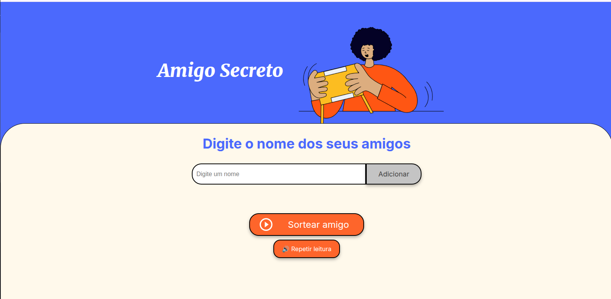

# 🎁 Challenge Sorteador de Amigos Secreto

Este é um projeto simples de um **Challenge Sorteador de Amigos Secreto**, feito com **HTML, CSS e JavaScript**. 
O usuário pode adicionar nomes à lista, sortear um nome aleatório e ouvir o resultado com um leitor de tela integrado!

## 🚀 Funcionalidades

✅ Adicionar amigos à lista  
✅ Sortear um amigo aleatório  
✅ Garantir que um nome sorteado não seja escolhido novamente  
✅ Resetar a lista automaticamente quando todos forem sorteados  
✅ Pressionar **Enter** para adicionar um nome (sem precisar clicar no botão)  
✅ **Leitor de Tela**: o nome sorteado é lido em voz alta  
✅ Botão "🔊 Repetir leitura" para ouvir o nome sorteado novamente  

## 🛠️ Tecnologias Utilizadas

- HTML5  
- CSS3  
- JavaScript  

## 📷 Captura de Tela



## 🎮 Como Usar

1. Abra o arquivo `index.html` em um navegador  
2. Digite um nome no campo e clique em **"Adicionar"** (ou aperte **Enter**)  
3. Depois de adicionar os nomes, clique em **"Sortear amigo"**  
4. O nome sorteado aparecerá na tela e será lido em voz alta  
5. Caso queira ouvir novamente, clique no botão **"🔊 Repetir leitura"**  
6. Quando todos os amigos forem sorteados, a lista será resetada automaticamente!  

## 📌 Como Executar Localmente

Se quiser rodar o projeto no seu computador:  
1. Faça o download ou clone este repositório:  
   ```bash
   git clone https://github.com/seu-usuario/sorteador-amigo-secreto.git
